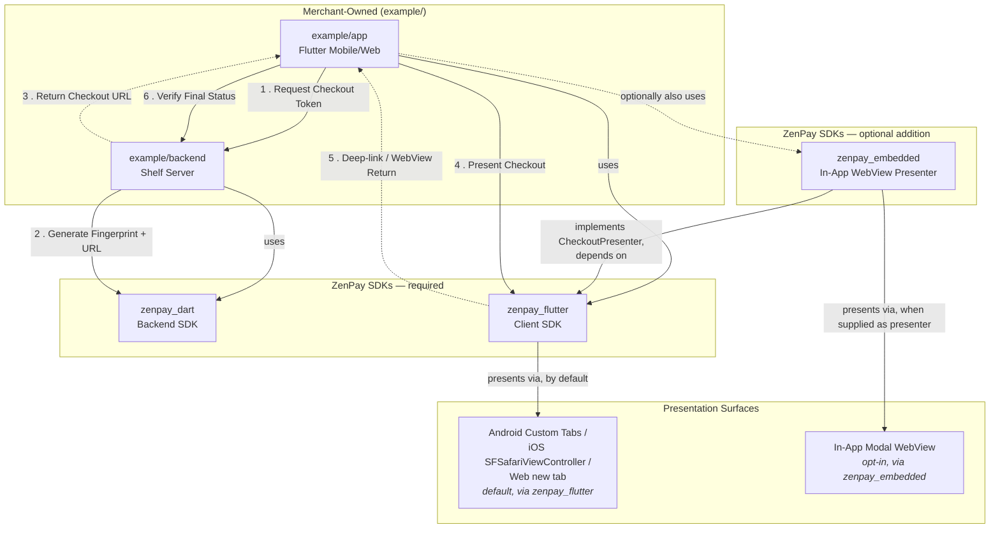

# Architecture

How the ZenPay Hosted Checkout SDKs, the reference example, and the optional embedded
WebView presenter fit together — and, in detail, how `zenpay_embedded` stays PCI DSS SAQ A
compatible when it does.

For what each package *is* in one line, see [README.md § 📦 Packages](README.md#-packages).
For every third-party dependency, see [PACKAGES.md](PACKAGES.md).

---

## 1. The Whole Integration, One Diagram



**Required path (every integration):** a merchant backend using `zenpay_dart` to build a
launch URL and later verify the callback/return, and a Flutter client using `zenpay_flutter`
to present that URL and detect the return. This is the whole SDK — `zenpay_flutter` alone is
a complete, production-ready integration.

**Optional addition:** `zenpay_embedded` does not replace any of the above. It swaps *one
thing only* — how the checkout URL gets presented — from a system browser surface (Custom
Tabs / `SFSafariViewController` / a new tab) to an in-app modal WebView. Everything else
(configuration, outcome types, return validation, backend verification) is identical and
untouched. See § 3.

---

## 2. End-to-End Flow

1. **Request** — the Flutter app asks `example/backend` for a checkout token
   (`POST /api/v1/checkout/token`), then exchanges it for a launch URL
   (`POST /api/v1/checkout/exchange`).
2. **Build** — the backend uses `zenpay_dart`'s `createZpFingerprint` +
   `createZpCheckoutUrl` to build the signed Authorise URL. Credentials and hashing never
   leave the backend.
3. **Return** — the backend hands the launch URL back to the app.
4. **Present** — the app calls `ZpCheckout.open(checkoutUrl: ...)`. `zenpay_flutter`
   presents it in a Custom Tab / `SFSafariViewController` / new tab by default, or in
   `zenpay_embedded`'s in-app WebView when a `presenter: EmbeddedCheckoutPresenter(...)` was
   supplied at construction — the call site is identical either way.
5. **Return detection** — a deep link (mobile), a `postMessage` handoff (web popup), or an
   intercepted WebView navigation (embedded) delivers the return URI back to `ZpCheckout`,
   which validates it (`ZpReturnValidator`) and settles one `ZpCheckoutOutcome`.
6. **Verify** — the app treats that outcome as **provisional only** and confirms final
   payment status against the backend's session-status endpoint, which itself only trusts
   ZenPay's own signed webhook (`verifyZpCallback`, constant-time `ValidationCode` check).

---

## 3. `zenpay_embedded`: An Addition, Not a Replacement

`zenpay_flutter` defines `CheckoutPresenter` — an abstract contract with one job,
`openCheckout(url, ...) -> PresentationLaunchResult`. `zenpay_flutter` ships the default
implementation (Custom Tabs / Safari / new tab). `zenpay_embedded`'s
`EmbeddedCheckoutPresenter` is a *second* implementation of that exact same contract, using
an in-app `webview_flutter` modal sheet instead.

```dart
final checkout = ZpCheckout(
  configuration: configuration,
  returnUriSource: presenter.returnUriSource, // only differs when embedding
  presenter: presenter,                        // <- this is the entire swap
);
```

Nothing about `ZpCheckoutConfiguration`, `ZpCheckoutOutcome`, launch URL validation, or
return URI validation changes. A merchant who never imports `zenpay_embedded` never resolves
its `webview_flutter` dependency at all — it is a genuinely optional, additive package, not a
fork or a variant SDK.

---

## 4. PCI DSS SAQ A & the Embedded WebView

Choosing `zenpay_embedded` over the default Custom Tabs/Safari presenter does not, by itself,
move an integration in or out of PCI scope — the ZenPay hosted page renders in the same
engine either way. What changes is the attack surface the host application is *capable* of
exposing to that hosted page.

📐 **See [PCI_SAQ_A.md](PCI_SAQ_A.md)** for the full comparison — why the system-browser
surface is the safer architectural default in the first place, the six concrete controls
`zenpay_embedded` enforces (three of them backed by dedicated `lefthook` regression guards),
the Google Pay manifest requirement, and the outstanding compliance gates that remain
before embedded mode can be advertised as SAQ-A-compatible.

---

## Related Guides

- **[README.md](README.md)** — repo overview, quick start, package index.
- **[PACKAGES.md](PACKAGES.md)** — every third-party dependency, version, maintainer, why.
- **[PCI_SAQ_A.md](PCI_SAQ_A.md)** — PCI DSS SAQ A across both presentation surfaces, in detail.
- **[zenpay_flutter/README.md](zenpay_flutter/README.md)** — the required client SDK's own usage docs.
- **[zenpay_embedded/README.md](zenpay_embedded/README.md)** — the optional embedded presenter's usage docs.
- **[CLAUDE.md](CLAUDE.md)** — contributor/agent guidelines, monorepo tooling.
