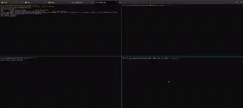
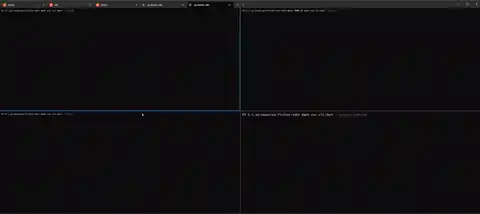

# ZenPay Hosted Checkout SDK for Flutter

Monorepo for the ZenPay Hosted Checkout Plugin (HCP) Dart/Flutter ecosystem: a pure-Dart backend SDK, a Flutter client SDK, and a runnable example that wires both together end-to-end.

🌐 **Live Web Demo:** [flutter-demo.zenithpayments.support](https://flutter-demo.zenithpayments.support)

📖 **New to this repo?** Start with [GETTING_STARTED.md](GETTING_STARTED.md) — clone, bootstrap, run the server and app.

Contributor/agent guidelines: [CLAUDE.md](CLAUDE.md) — start there before touching any package. `AGENTS.md` in this folder is a symlink to it.

---

## 📱 Previews

|     Android Native Launch     |            Android In-App WebView             |
| :---------------------------: | :-------------------------------------------: |
|  |  |

---

## 🏗️ Architecture

The repository is structured to mirror exactly how you will integrate ZenPay into your own production systems: a backend using the pure-Dart SDK for cryptography and secure session creation, a client using the Flutter SDK for presentation, and an optional embedded WebView presenter layered on top of that.

📐 **See [ARCHITECTURE.md](ARCHITECTURE.md)** for the full integration diagram, the end-to-end flow, and how `zenpay_embedded` adds an alternate presentation without replacing anything.

🔒 **See [PCI_SAQ_A.md](PCI_SAQ_A.md)** for PCI DSS SAQ A across both presentation surfaces — why the default is the safer architectural choice, and every control `zenpay_embedded` enforces when you opt into the alternative.

---

## 📦 Packages

| Package                                      | Path              | What it is                                                                                                               |
| :-------------------------------------------- | :---------------- | :----------------------------------------------------------------------------------------------------------------------- |
| [`zenpay_dart`](zenpay_dart/README.md)       | `zenpay_dart/`    | Pure-Dart backend SDK: fingerprints, launch URLs, callback verification, callback URL tokens. Server-side only.          |
| [`zenpay_flutter`](zenpay_flutter/README.md) | `zenpay_flutter/` | Flutter client SDK: presents ZenPay Hosted Checkout, handles the return, reports one typed outcome.                      |
| [`zenpay_embedded`](zenpay_embedded/README.md) | `zenpay_embedded/` | Optional in-app WebView presenter, layered on top of `zenpay_flutter` — see [ARCHITECTURE.md](ARCHITECTURE.md). Opt-in only, not the default. |
| [example](example/README.md)                 | `example/`        | Combined reference: a Shelf backend (`example/backend/`) and a Flutter app (`example/app/`) demonstrating the full flow. |

Each package has its own `CLAUDE.md` (agent guidelines) and `README.md` (usage docs); every `CLAUDE.md` has an `AGENTS.md` symlink alongside it.

📦 **Third-party dependencies:** See [PACKAGES.md](PACKAGES.md) for every external package this repo uses — version, maintainer, and why.

For setup steps, running the stack, and verifying changes, see [GETTING_STARTED.md](GETTING_STARTED.md).

---

## License

See [LICENSE](LICENSE).
